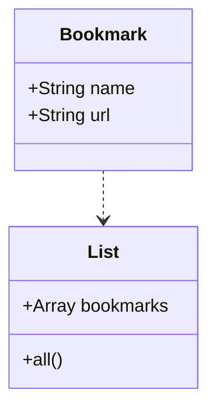

## Database Setup
### CREATE database
CREATE DATABASE bookmarks
CREATE TABLE bookmarks(id SERIAL PRIMARY KEY, url VARCHAR(60) NOT NULL)

### Create test database
CREATE DATABASE bookmarks_test
CREATE TABLE bookmarks(id SERIAL PRIMARY KEY, url VARCHAR(60) NOT NULL)

## Requirement:
Show a list of bookmarks
Add new bookmarks

## User story:
As a user
So that I can know what my bookmarks are
I want to be able to view a list of bookmarks

As a user
So that I can record new bookmarks
I want to be able to add a new bookmark to my list of bookmarks.

## Diagram:
