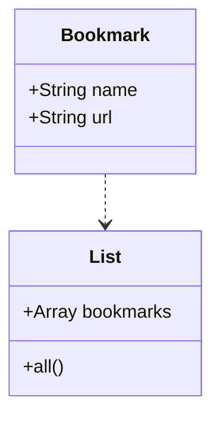

## Requirement:
Show a list of bookmarks

## User story:
As a user
So that I can know what my bookmarks are
I want to be able to view a list of bookmarks

## Diagram:

```mermaid
classDiagram
  Bookmark ..> List

  class Bookmark {
    +String name
    +String url 
    }

  class List {
    +Array bookmarks   <!-- display method, maybe needed, maybe sits in different class-->

    +all()
  }
```